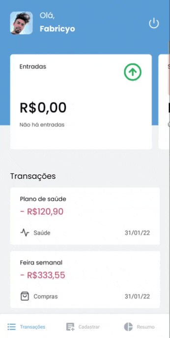

<h1 align="center">
 
  
 
 
MyFinances
</h1>

Um aplicativo para organizar sua vida pessoal financeira, tenha mais controle na hora de gastar.

  

[//]: # (Add your gifs/images here:)

  
  
  

## Features

[//]: # (Add the features of your project here:)

Nessa aplicação foram utilizados as seguintes tecnologias abaixo:

- **React Native** — Uma biblioteca javascript para construção de aplicações
  mobile.
- **Javascript** — Uma linguagem de programação.
- **Typescript** — Um super set para o javascript que auxilia na codificação.

## Getting started

Primeiro faça o clone do repositório:   `git clone {url do repositório}`
   Logo após baixe as dependências:   `yarn install` ou `npm install`
   Agora inicie o projeto(tenha o expo instalado na sua máquina):  
`expo start`   Veja a aplicação no aplicativo do Expo Go direto no celular
ou por um emulador no pc

## License

This project is licensed under the MIT License - see the
[LICENSE](https://opensource.org/licenses/MIT) page for details.
